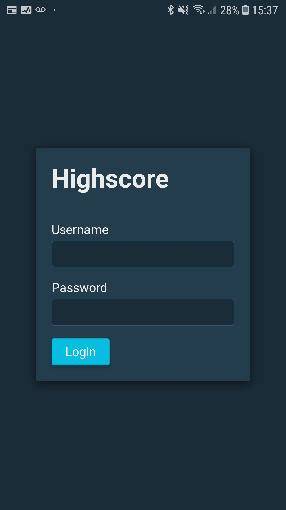
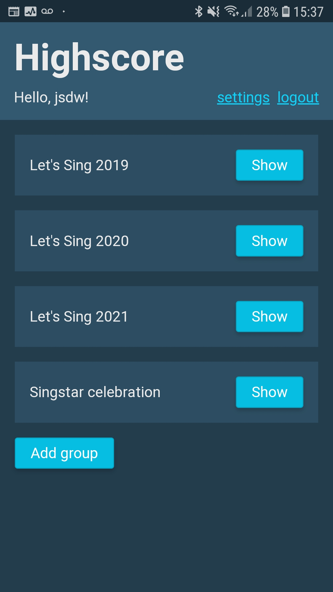
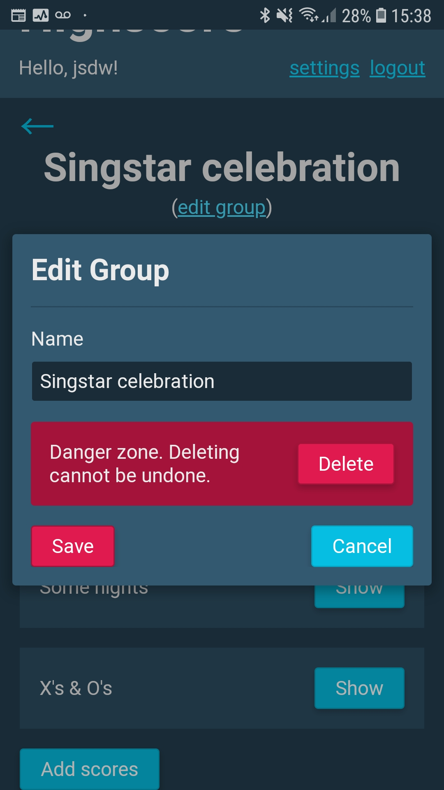
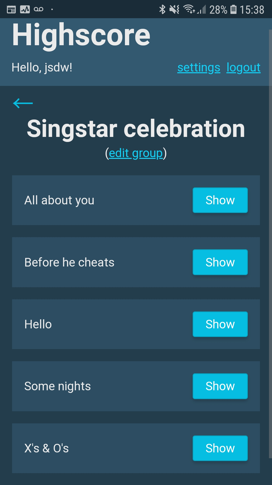
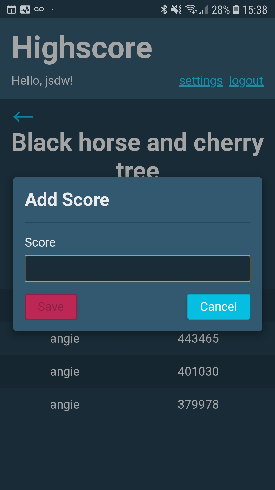
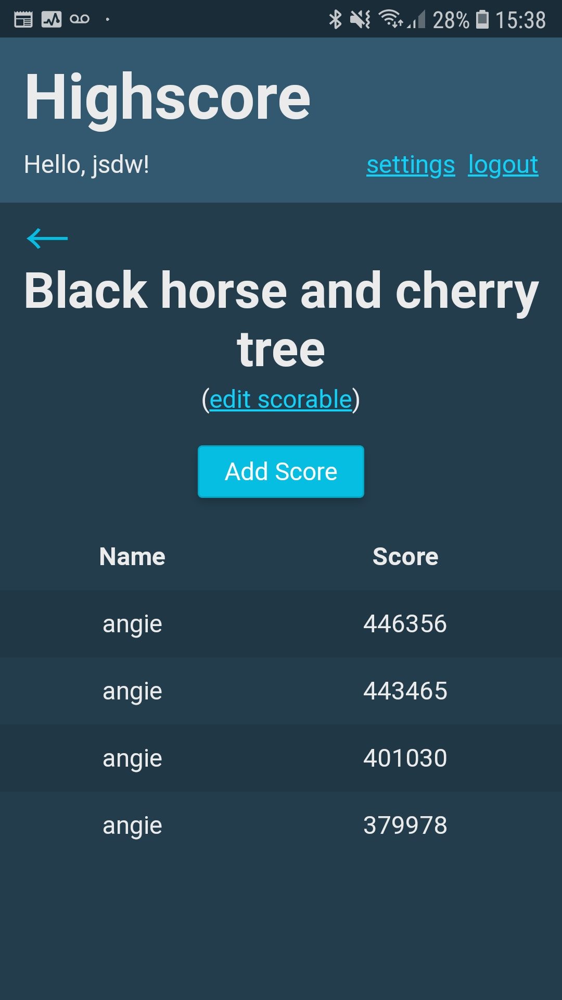

# Highscore

A small mobile-friendly app for tracking scores on things that can be easily self-hosted.

|          |        |  |
|-----------------------------------------|-----------------------------------------|-------------------------------------------|
|  |  |          |

## Running

Read below to find out how to install the app.

To use Highscore, you must first add users to the database via the CLI tool (swap `$USER` with whatever username you prefer):

```
highscore users add $USER --database ~/highscore.db
```

This initialises a database file (here, `~/highscore.db`) if one doesn't exist, or adds a user to an existing one, updating the user password if said user already exists.

Next, serve the application, pointing to the same database as above:

```
highscore serve --database ~/highscore.db
```

Other options are available, use `--help` to find out more.

## Installation from source

Requires a fairly recent version of Rust.

1. Build the client code (this must happen first).
   ```
   (cd client && npm install && npm run build
   ```
2. Build the server binary (requires a fairly recent version of Rust).
   ```
   cargo build --release
   ```
3. Put the compiled binary somewhere.
   ```
   cp ./target/release/highscore $SOMEWHERE
   ```

## Notes

- This app was written over the course of ~5 days to solve a personal use case. I'll be happy enough with exposing an instance of it to the world, but I've deliberately avoided putting too much effort into various aspects of it!
- The persisted "database" is an append-only event log that is read into and kept in sync with an in-memory representation of the data as needed. This mainly avoids the (immediate) need to think about database migrations and so forth, while providing a level of persistence and minimising writes when compared with blatting out the entire representation each time.
- Users can add scores on behalf of each other and so on via the API (though the UI doesn't expose this). The app requires user accounts to exist as it'll potentially be exposed to the world, but allows users to do whatever they like once they're authenticated.
- `store_interface::Store` abstracts the necessary IO, so that I can use an in-memory store, or migrate to something like SQLite in the future with, hopefully, not too much effort.
